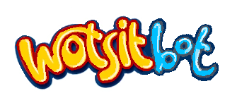
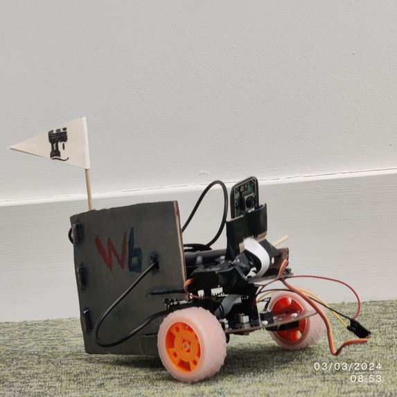

  

    Won Best Demo at Hack The Burgh! Differential Drive Robot helping young learners discover information about the world.
     
     
    <a href="https://devpost.com/software/wotsitbot">View Devpost</a>
    ·
    <a href="https://github.com//aswarbs/wotsitbot/issues">Report Bug</a>
    ·
    <a href="https://github.com/aswarbs/wotsitbot/issues">Request Feature</a>
  

## About the Project

We wanted to make something hardware based, user-centric and fun! So we made a teleoperational robot that lets you collect 'things' in the real world, whilst simultaneously educating its users!

We really tried to make a hardware project scalable, so used a lot of servers, and also tried to solve a real world problem: kids having fun in a physio-digital world.

We had to make a video streaming standard for GMS2, as there is almost no support for loading images from a stream, let alone streaming.

We built a homemade differential drive robot, along with a camera and a tilt servo. The entire thing is powered by a Raspberry Pi 3.

Then a game interface is produced using GameMaker Studio 2, which allows the user to control the robot, and see what it sees, which is all done through websockets and a UDP server.

When a user selects an object in the world, we run a local Segment Anything model to mask the object, and then pass it into OpenAI to retrieve what the object is. Information and pictures about the object are then scraped from the internet, and redisplayed to the user!

## Contributors

- Adrian built the robot, and created the interfaces required to communicate with it, including receiving the camera data.
- Toby worked on the front end, radio, stream rendering (with Amber), controls and feedback. Toby also made something to webscrape images but we ran out of time to integrate!
- Amber integrated a local segment anything model to segment the object on the mouse click, handled networking between the Pi and GameMaker, and integrated OpenAI API to detect objects (with Daudi).
- Daudi created a Rust Websocket to seamlessly separate the object detection process and handled networking.

## License

The project is distributed under the MIT license. See `LICENSE.md` for more information.

